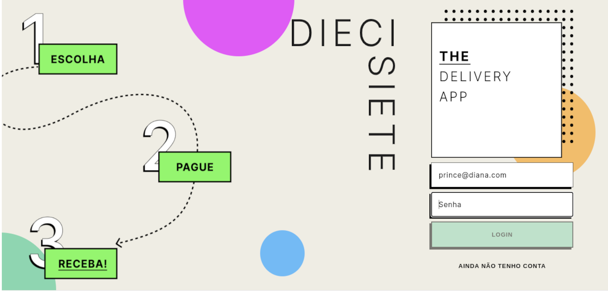

# Delivery App




## Description

<p style="text-align: justify">
Full Stack Application built using React, Styled Components, Nodejs, Express, Sequelize, and MySQL. The Application is a beverage delivery with features for users, sellers and admins using JWT authentication.
</p>

## Requirements

requirements...


## How to Run


```bash
git clone https://github.com/ocarlosbarros/delivery-app
```
```bash
cd delivery-app-project
```

# 🚧 Step em construção...

- Steps...

# 🚧 Step em construção...

- Steps...

## Tecnologies and Libs

### **Frontend**

* React
* Styled Components

### **Backend**

* Nodejs
* Express
* Sequelize
* MySQL
* JWT

